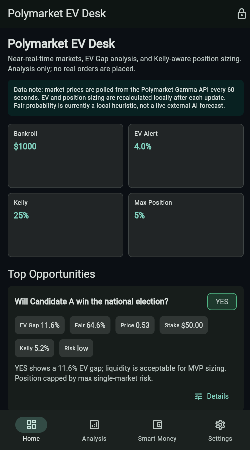
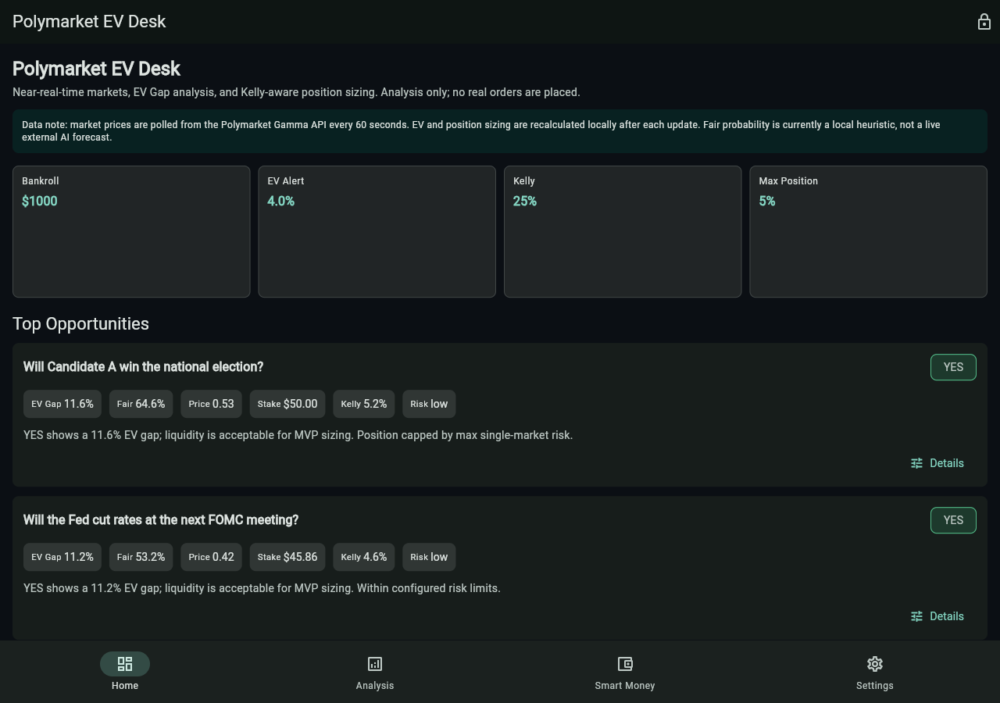

# Polymarket EV Desk

一个用 Flutter + Vibe Coding 工作流完成的预测市场 EV 分析 PWA。项目目标不是自动下单，而是把 Polymarket 市场数据、EV Gap、聪明钱观察和仓位管理做成可以在手机上快速演示的研究型产品。

> MVP is analysis-only. It does not sign wallets, custody funds, or place real trades.



## 项目定位

Polymarket 等预测市场的价格可以被视为市场隐含概率，但价格并不等于真实概率。这个项目围绕一个具体问题展开：当研究员或交易者有自己的 fair probability 判断时，如何快速判断某个 YES/NO 合约是否存在正 EV，并给出受风险约束的仓位建议。

MVP 覆盖从需求拆解、产品原型、前端实现、准实时数据接入、风控模型到部署演示的闭环，适合作为 APP-AI-产品工程师 / PE / PM 面试作品。

## Demo

- 在线 Demo：<https://ev.aldacareer.online>
- Web/PWA 体验包：见 GitHub Release 或本地 `release/` 目录。
- iPhone 演示方式：用 Safari 打开 HTTPS Demo URL，然后选择“添加到主屏幕”。
- 当前 Windows 本地预览：`http://localhost:8080`

如果暂时没有公开域名，也可以把 `polymarket_ev_desk_web_demo.zip` 解压到任意 HTTPS 静态站点、Nginx、Cloudflare Pages、Vercel 或 GitHub Pages。

## 核心功能

- 热门市场展示：准实时展示市场问题、YES/NO 价格、成交量、流动性和价差。
- EV Gap 分析：计算隐含概率、fair probability、EV Gap、置信度和风险标签。
- 机会排序：按 EV Gap、流动性和风险等级筛选排序。
- 仓位管理：Fractional Kelly、单市场最大仓位、单日亏损限制、相关性风险提示。
- 聪明钱模块：MVP 使用 mock wallet activity，展示大额交易、历史胜率和最近动作。
- 语言切换：设置页支持 English / 中文，中文模式会本地化常见市场标题并保留英文原题。
- PWA 支持：适合移动端浏览器加入主屏幕演示。
- 安全边界：交易执行仅保留入口和 UI 占位，不在客户端保存真实交易密钥。

## 技术栈

- Flutter 3.24+ / Dart
- Riverpod
- SharedPreferences
- flutter_secure_storage
- Material 3
- Polymarket Gamma API proxy with mock fallback
- Python tiny static server for VPS deployment

## 产品截图

### Mobile PWA


### Desktop dashboard



## 项目结构

```text
lib/
  main.dart
  l10n/
    app_text.dart
  models/
    market.dart
    opportunity.dart
    risk_settings.dart
    smart_money_signal.dart
  pages/
    home_page.dart
    analysis_page.dart
    smart_money_page.dart
    settings_page.dart
  repositories/
    polymarket_repository.dart
  services/
    ai_analysis_service.dart
    notification_service.dart
    risk_service.dart
  state/
    app_providers.dart
  widgets/
    metric_tile.dart
    opportunity_card.dart
docs/
  screenshots/
  user-research.md
  demo-script.md
  deployment-vps.md
test/
  risk_service_test.dart
tool/
  static_server.dart
```

## 数据和分析逻辑

`PolymarketRepository` 负责隔离数据来源。Web 环境优先访问同源 `/api/polymarket/events`，由本地或 VPS server 代理到 Polymarket Gamma API；接口失败时自动回退到 mock 数据，保证 demo 不会因为网络波动空白。

当前同步方式是 near-real-time polling：市场列表每 60 秒刷新一次，EV Gap 和仓位建议会在每次数据更新后本地重算。它不是 CLOB websocket，也不是毫秒级盘口交易系统。

`AiAnalysisService` 当前使用可解释的本地启发式模型估计 fair probability：综合市场隐含概率、成交量、流动性和价差惩罚。正式版本可以替换为后端 AI research model 或 OpenAI API 分析服务。

`RiskService` 使用 Fractional Kelly 给出仓位建议，并叠加以下约束：

- `kellyFraction`
- `maxPositionPct`
- `dailyLossLimitPct`
- `correlationPenalty`

## 本地运行

```powershell
cd "C:\Users\18060\Documents\New project\polymarket_ev_mvp"
$env:Path = "C:\tools\flutter\bin;" + $env:Path
flutter pub get
flutter analyze
flutter test
flutter run -d chrome
```

构建 Web/PWA：

```powershell
flutter build web --release --no-wasm-dry-run --pwa-strategy=none
```

启动本地静态服务：

```powershell
C:\tools\flutter\bin\cache\dart-sdk\bin\dart.exe run tool/static_server.dart build/web 8080
```

## Windows、Android 和 iOS 说明

Windows 可以开发 Flutter Web 和 Android，但需要 Android Studio / Android SDK 才能打 APK。当前机器尚未安装 Android SDK，因此本项目交付 Web/PWA 体验包。

iOS 原生 App 的编译、签名、TestFlight 和 App Store 发布必须使用 macOS + Xcode + Apple Developer 账号。Windows 不能直接构建或签名 iOS App。对于面试演示，PWA 是最现实的 iPhone 展示路径。

## 安全说明

- 不把 Polymarket 私钥、钱包助记词或真实交易 key 写入客户端。
- OpenAI API Key 只作为设置页预留项，不建议在生产前端直连使用。
- 真实交易应由后端执行签名、限价单、滑点保护、订单状态校验和人工确认。
- 项目仅用于研究和产品演示，不构成投资建议。

## 后续路线图

- 接入真实 Polymarket CLOB / Gamma 数据字段映射。
- 接入后端 OpenAI fair probability explanation。
- 接入 wallet/indexer/subgraph 作为聪明钱数据源。
- 添加服务端定时扫描和推送通知。
- 增加机会详情页的历史价格、成交深度和假设敏感性分析。
- 构建 Android APK 或 macOS 环境下构建 iOS TestFlight 包。

## 面试展示重点

这个项目重点展示三件事：

1. 能把模糊的交易/AI 想法拆成可落地的 MVP 产品。
2. 能用 AI-native / Vibe Coding 方式快速完成需求、设计、开发、测试和部署闭环。
3. 知道金融类产品的风险边界，不为了“炫技”把真实资金密钥放到客户端。
