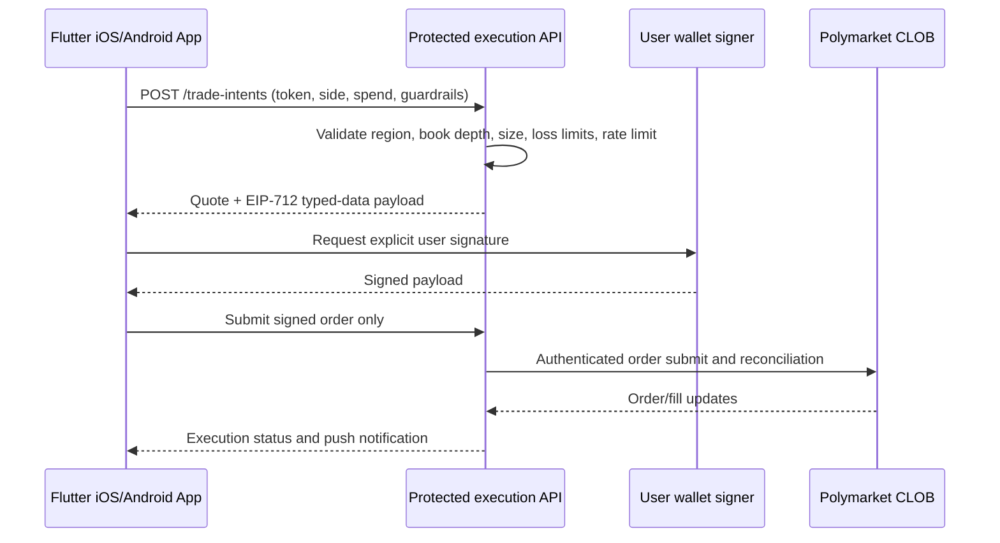

# Mobile Delivery and Execution Architecture

## Shipped Mobile Surface

- One Flutter codebase for Android and iOS, generated from the same `lib/` tree.
- Native Android project with internet and Android 13 notification permissions.
- Native iOS Runner project with HTTPS-only app transport security.
- Market discovery, CLOB order-book depth, price history, EV analysis, Fractional Kelly sizing, watchlist, local paper portfolio, bilingual UI, and external market handoff.
- Optional local opportunity notifications, requested explicitly from Settings and disabled by default.

## Real Order Boundary

The mobile application never stores a wallet private key, CLOB secret, or passphrase. It only creates a non-sensitive `TradeIntent` containing market token, side, maximum spend, limit/market preference, quote timestamp, and risk limits.



The service must use user-controlled signing or a managed remote signer with explicit consent. It must never accept a raw private key from the app.

## Production Backend Contract

### `POST /v1/trade-intents`

Input: `tokenId`, `side`, `amountUsd`, `orderType`, `maxSlippageBps`, `clientQuoteAt`.

Server checks: user session, supported region, available balance/allowance, CLOB tick size/minimum size, order-book depth, daily loss, correlated exposure, and idempotency key.

Output: immutable quote, expiry, CLOB protocol version, typed data to sign, and a one-time intent ID.

### `POST /v1/trade-intents/{id}/submit`

Input: wallet signature. The API validates the signature and expiry, submits the order, then listens to the authenticated CLOB user stream. The app displays accepted, filled, partially filled, cancelled, or rejected states.

## Release Checklist

1. Use a real reverse-domain application ID registered to the publisher before App Store or Play Console submission.
2. Configure Android release signing in `android/key.properties`; keep the keystore out of Git.
3. Build Android App Bundle: `flutter build appbundle --release`.
4. On macOS with Xcode, select a Team and provisioning profile, then run `flutter build ipa --release`.
5. Connect FCM/APNs through a backend before enabling production trading notifications.
6. Verify the local opportunity-alert permission flow on one physical Android device and one physical iPhone.
7. Run jurisdiction, age, KYC, and platform-policy review before making an execution endpoint available.

### Android signing setup

```powershell
keytool -genkeypair -v -keystore polymarket-ev-desk-upload.jks -alias polymarket-ev-desk -keyalg RSA -keysize 2048 -validity 10000
Copy-Item android/key.properties.example android/key.properties
flutter build appbundle --release
```

The generated installable artifact is `build/app/outputs/bundle/release/app-release.aab`. Use Play Console internal testing before public distribution.
